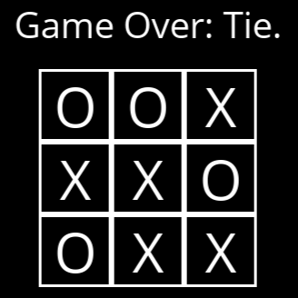

# TICTACTOE

---
A bare bone implementation of the TicTacToe (X & O's)
### What It Does
---
This is a simple implementation of the widely known game TicTacToe (X & O's), it feats a simple GUI through which users can interact with and play against an AI player.

### Implementation
---
The process of determining the optimal move to make against the user was implemented using the `minimax algorithm`.

### Installation
---
You can download the executable file [here](https://github.com/lifeofdmt/TicTacToe/releases/tag/v1.0.0)
> [!NOTE]
> The program is only available on windows